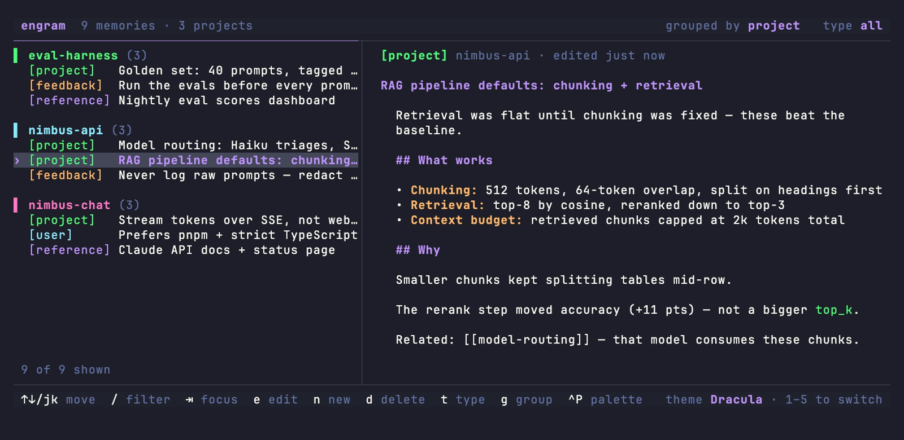

# engram

> A terminal UI for browsing, searching, and sharing your Claude Code memories.

`engram` is a fast, single-binary TUI that surfaces the memories Claude Code
keeps on your machine — across **all** your projects — in one searchable place.
Browse them, read them rendered as markdown, edit them in your `$EDITOR`, and
share the useful ones with your team over any git host.

The name comes from neuroscience: an *engram* is the physical trace a memory
leaves in the brain. That's exactly what these files are — the traces Claude
keeps so it can remember things across sessions.

**Latest release: `v0.2.1`** · open source ([MIT](LICENSE)) · website:
[engram.im](https://engram.im) · what's next: [ROADMAP.md](ROADMAP.md) ·
design: [SPEC.md](SPEC.md)



## Why

Claude Code already stores memories as markdown files under
`~/.claude/projects/<project>/memory/`. But they're scattered one-folder-per-project,
they're awkward to read raw in a pager, and there's no good way to share the
team-useful ones with colleagues. `engram` fixes all three.

It is **not** a replacement for committing a `CLAUDE.md` to a repo — it covers
the gap that can't: cross-project memories, personal-vs-team layering, and a
proper UI.

## Install

**Homebrew** (macOS — installs the latest release):

```sh
brew install ertugrulhaskan/tap/engram
```

**Go** (requires [Go](https://go.dev/dl/) 1.23+; works on Linux/Windows too):

```sh
go install github.com/ertugrulhaskan/engram@latest
```

**Prebuilt binaries** for macOS / Linux / Windows (amd64 + arm64) are attached to
each [release](https://github.com/ertugrulhaskan/engram/releases).

**From source:**

```sh
git clone https://github.com/ertugrulhaskan/engram.git && cd engram
go mod tidy        # fetches dependencies (needs network, first time only)
go run .           # run it
go build -o engram # or build a binary
```

## Usage

Just run it:

```sh
engram
```

The left pane lists every memory found across all your projects, grouped under
colored headers; the right pane shows the selected memory rendered as markdown.
The list reloads automatically when memory files change on disk.

| Key        | Action                                  |
|------------|-----------------------------------------|
| `↑`/`↓` `j`/`k` | move through the list              |
| `pgup`/`pgdn` | page through the list                |
| `/`        | filter / search the list                |
| `tab`      | switch focus between list and preview   |
| `e`        | edit the selected memory in `$EDITOR`   |
| `n`        | create a new memory in the current project and open it in `$EDITOR` |
| `d`        | delete the selected item (asks `y`/`n` first) |
| `t`        | cycle the type filter                   |
| `g`        | toggle grouping: by project ⇄ by type   |
| `R`        | reconcile the project's `MEMORY.md` index (shown when out of sync) |
| `1`–`5`    | switch theme                            |
| `ctrl+p`   | open the command palette (see below)    |
| `?`        | help — a keybinding cheat-sheet overlay (any key closes) |
| `q` / `ctrl+c` | quit                                |

`n`, `d`, and `e` keep the project's `MEMORY.md` index in sync, so Claude Code
picks up the changes. When an index drifts anyway — files added without an index
line, or entries left behind by a deleted or renamed file — the warning names the
cause and `R` reconciles it.

### The command palette (`ctrl+p`)

The palette opens to three guide rows; what you type decides what it does:

- **`/` — sources.** Switch what the list shows: `/memory` (the default),
  `/plans` (your plan-mode plans, grouped by recency), `/files` (see below),
  or `/settings` (opens engram's config file in your `$EDITOR`).
- **`@` — assistant.** `@Claude` hands off to an interactive
  [Claude Code](https://claude.com/claude-code) session, seeded with the selected
  project's memory/plan health, to fix what `R` can't (malformed frontmatter,
  broken `[[links]]`, memories stranded by a renamed project folder) and to
  create, rewrite, or merge memories on request. engram reloads when the session
  exits. Requires the `claude` CLI on `PATH`; without it the palette action shows
  a one-line hint.
- **`>` — team commands.** `>init`, `>promote`, `>pull`, `>resolve`,
  `>withdraw` — covered in [Team sharing](#team-sharing) below.
- **Anything else — jump.** Plain text (no prefix) fuzzy-matches memory and plan
  titles and jumps straight to the match.

### `/files` — read-only view of Claude's own files

`/files` lists the global `~/.claude/CLAUDE.md`, each project's `CLAUDE.md`
(when its directory resolves on disk), and each project's `MEMORY.md` index.
These are **view-only** — `e`/`d` point you at `@Claude` instead of editing them
directly, so the index and your instructions don't get hand-corrupted.

## Reading the list

- **Grouping.** Rows sit under a colored `▌ Group (N)` header with a count. For
  memories, `g` toggles between grouping **by project** and **by type**; plans
  group **by recency** (Today / This week / Older). The selected row is marked
  with a `›` cursor.
- **Type badge.** Each memory shows a colored badge for its type, taken from
  Claude's `metadata.type`:

  | Badge | Color | Meaning |
  |-------|-------|---------|
  | `[user]` | blue | a fact about you (role, preferences) |
  | `[feedback]` | orange | guidance on how to work |
  | `[project]` | green | something specific to that codebase |
  | `[reference]` | purple | a pointer to an external resource |
  | `[other]` | gray | no type recorded (the `t` filter calls this `unknown`) |

  `t` cycles the type filter through exactly this order:
  all → user → feedback → project → reference → unknown.

- **Sync badge.** Once you share, a team-scoped memory shows a filled pill for
  its state against the team store. A **sync anchor** (a content digest recorded
  when you last promoted or pulled) lets engram name a direction:

  | Badge | State | What to do |
  |-------|-------|------------|
  | `✓` | synced | nothing |
  | `↓` | incoming — the store advanced, your copy is untouched | `>pull` (or `>resolve`) |
  | `↑` | ahead — you have unshared edits | `>promote` |
  | `↕` | conflict — both sides moved | `>resolve` |
  | `!` | missing — promoted but not in the store | `>promote` |
  | `●` | differs — shared before the anchor existed, so no direction | `>resolve` |

  Personal memories show no pill, and the column vanishes until you set up a
  team store.
- **Scope chip.** A color-coded `global` (teal) / `project` (azure) chip sits
  beside the sync pill, showing whether a shared memory is team-wide or tied to
  one project — the choice you make when you promote.

## Team sharing

Team sharing lives under the **`>` command palette** (`ctrl+p`, then type `>`);
normal use stays a no-arg TUI. The team store is a git repo your team reads and
writes.

### Setup

```sh
engram init-team <git-url>   # or >init <git-url> in the palette
```

This clones the team repo to `~/.config/engram/team/` and, if the repo is empty,
scaffolds `global/`, `projects/`, and `MEMORY.md`, then commits and pushes the
starter layout (a failed push is non-fatal — the local commit is kept, with a
retry hint).

### The commands

`>promote`, `>resolve`, and `>withdraw` act on the selected memory; `>pull`
applies store-wide. Each surfaces a clear error if the team store isn't set
up yet:

- **`>promote`** — copies the memory into the store. A scope dialog picks *this
  project* (keyed by its git remote) or *global*. engram stamps the shared copy
  with an `engram:` frontmatter block (a durable id, scope, project, owner —
  leaving Claude's own keys untouched) and commits + pushes. Before pushing,
  engram **scans the memory for secrets** and by default blocks the promote on a
  hit, showing the redacted match with an option to override (tunable — see
  [Configuration](#configuration)).
- **`>pull`** — brings the team's **project-scoped** memories down into their
  matching local projects. When only the store moved and your copy is untouched,
  pull **fast-forwards** it automatically; a copy you edited is left alone, and a
  genuine divergence is flagged as a conflict rather than overwritten. Pull walks
  past *global* memories — take an incoming global memory with `>resolve`.
- **`>resolve`** — opens both versions of a conflict with git-style markers in
  your `$EDITOR` and writes your merge back, re-anchored so "take theirs" reads
  as synced.
- **`>withdraw`** — takes a shared memory back (after a confirm), if you're its
  owner: it removes the copy from the store, resets your memory to personal,
  and, via a tombstone, removes it from teammates on their next pull.
  `>promote` again puts it back.

## Configuration

engram's config lives at `~/.config/engram/config.json` (open it with
`/settings` in the palette):

| Key | Values | Default |
|-----|--------|---------|
| `theme` | theme name, e.g. `"Nord"` — saved automatically when you press `1`–`5` | Dracula |
| `editor` | editor command override, e.g. `"code --wait"` — when unset, `$VISUAL` / `$EDITOR` apply | — |
| `secretScanAction` | `block` · `block-strict` (no override) · `warn` · `off` | `block` |
| `secretScanScope` | `secrets` · `secrets+pii` | `secrets` |

The secret scan uses a curated rule set — a guard, not a guarantee, so treat the
override as a real decision.

## CLI

`engram` is a no-arg TUI; the few subcommands are:

```sh
engram                       # launch the TUI
engram init-team <git-url>   # set up the team store (same as >init)
engram version               # print the version (also --version / -v)
engram help                  # print usage (also --help / -h)
```

## How it works

`engram` reads memory files from `~/.claude/projects/*/memory/*.md`. It supports
two on-disk shapes, because Claude Code uses both:

1. **YAML frontmatter** — `name`, `description`, `metadata.type`
2. **Plain markdown** — a `# Heading` title, with the one-line description pulled
   from the project's `MEMORY.md` index (`- [Title](file.md) — hook`)

Files are never modified except when you explicitly edit one. See
[SPEC.md](SPEC.md) for the full data model and the sharing design.

## Roadmap (short version)

- **Phase 1** — browse / search / view / edit local memories *(done — `v0.1.0`)*
- **Phase 1.5** — assisted maintenance: `@Claude`, read-only `/files` *(core in `v0.1.0`)*
- **Phase 2** — team sharing over git: `init-team`, promote / pull / withdraw / resolve, sync badges + secret-scan *(shipped — `v0.2.0`)*
- **Phase 3** — release / go public: binaries + Homebrew tap, [engram.im](https://engram.im) *(shipped — live)*
- **Phase 4** — other assistants' memories (Claude.ai, ChatGPT, …) as access allows

## Contributing

Contributions welcome! The codebase is small and deliberately layered:
`internal/memory` (discovery + parsing + file mutation, no UI) and `internal/tui`
(Bubble Tea UI, no file logic). See [CONTRIBUTING.md](CONTRIBUTING.md) for build
and test instructions — including the "Landing page" section for working on the
[engram.im](https://engram.im) site under [`www/`](www/) — and [SPEC.md](SPEC.md)
for the design. By participating you agree to the
[Code of Conduct](CODE_OF_CONDUCT.md).

## License

[MIT](LICENSE) — free to use, modify, and share. Provided **"as is," with no
warranty**; the author isn't liable for any loss or damage from using it. engram
edits files under `~/.claude/` and syncs them over git, so keep backups of anything
you can't afford to lose.
